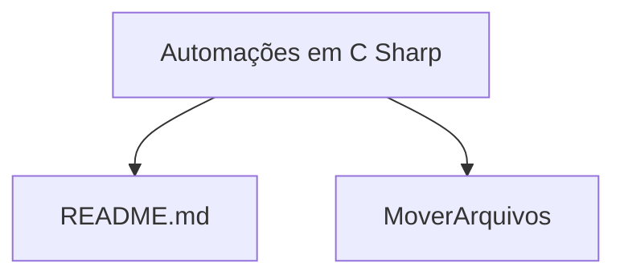

# Automações em C#

Esse repositório de tipo monolítico colecionará projetos de **Automações em C#**.

## Objetivo

1. **Criar** um repositório central para **versionar** diferentes projetos que tem em comum:
- **Automação de processos;**
- **Linguagem C#**

2. **Demonstrar** habilidades de criação de soluções em **RPA**.

## Estrutura do Repositório

# Automacoes-C-Sharp
Monorepo com Automações em linguagem C Sharp.
